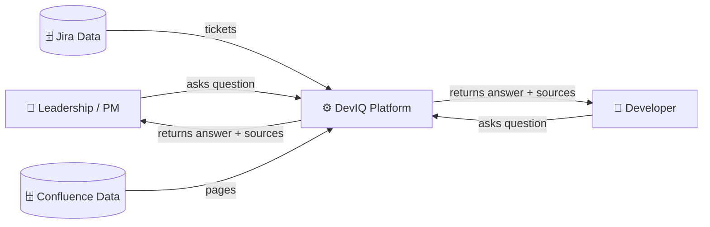
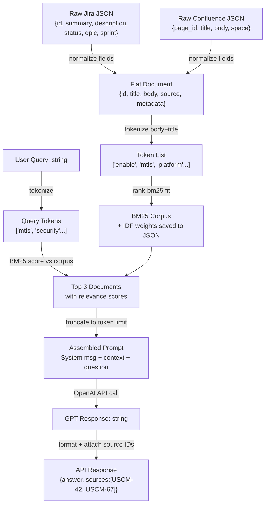
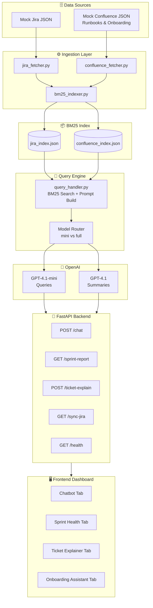
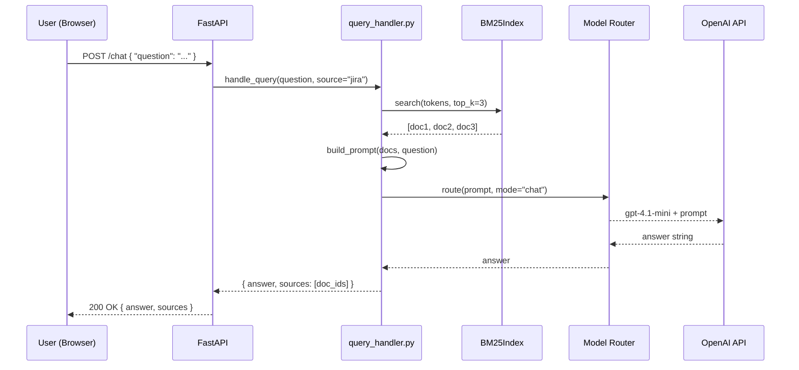
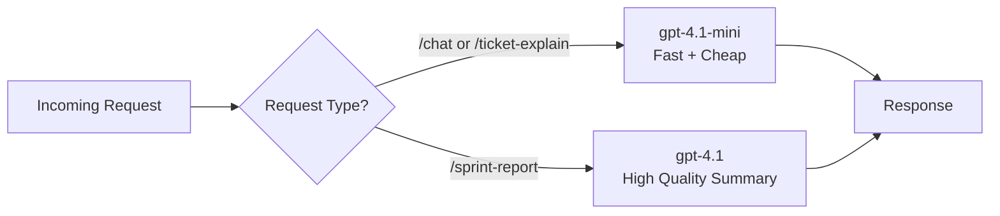

# Deviq

Deviq is a small project that demonstrates a simple backend + frontend demo with architecture diagrams included in the repository.

## Project Overview

- Backend: serves APIs and ingestion pipelines (see `backend/`).
- Frontend: single-page app built with Vite (see `frontend/`).

## Quick Start

Prerequisites: Python 3.10+ for the backend, Node 16+ for the frontend.

Run backend (example):

```bash
cd backend
python -m pip install -r requirements.txt
# then run the app as appropriate (see backend/main.py)
python main.py
```

Run frontend (example):

```bash
cd frontend
npm install
npm run dev
```

## Architecture Diagrams

Below are the Mermaid diagrams included directly so GitHub (and many editors) will render them inline. If you prefer standalone SVG/PNG files, see the "Generate SVGs locally" instructions after the diagrams.

### Data Flow — Level 0



### Data Flow — Level 1



### High-Level Architecture



### Low-Level — Sequence



### Low-Level — Model Routing (flow)

