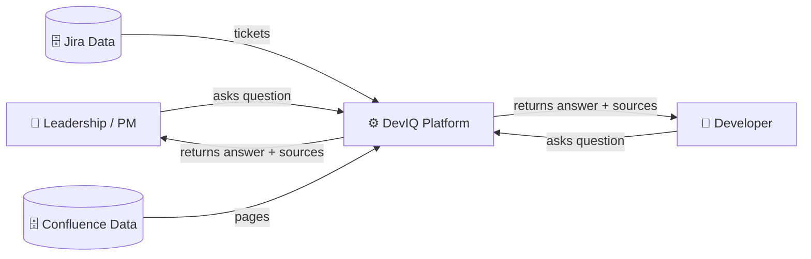
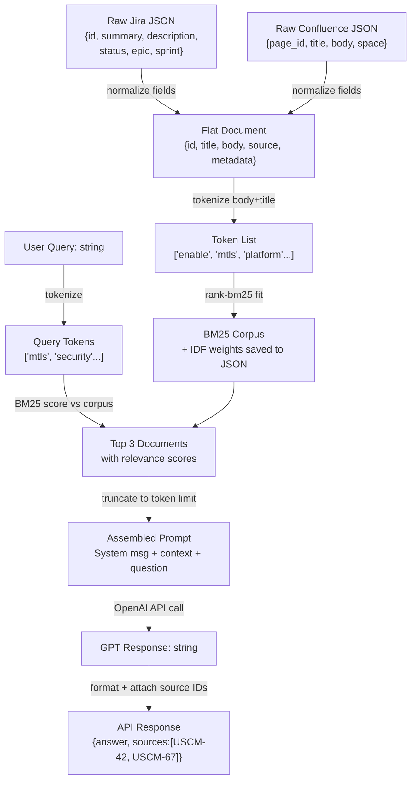

# DevIQ — Data Flow Diagram

## Level 0 — Context Diagram (The 30-second view)

```mermaid
flowchart LR
    PM["👤 Leadership / PM"] -->|asks question| SYS["⚙️ DevIQ Platform"]
    DEV["👤 Developer"] -->|asks question| SYS
    SYS -->|returns answer + sources| PM
    SYS -->|returns answer + sources| DEV
    J[("🗄️ Jira Data")] -->|tickets| SYS
    C[("🗄️ Confluence Data")] -->|pages| SYS
```

## Level 1 — Internal Data Flow

```mermaid
flowchart TD
    A["Raw Jira JSON\n{id, summary, description,\nstatus, epic, sprint}"]
    B["Raw Confluence JSON\n{page_id, title, body, space}"]

    A -->|normalize fields| C["Flat Document\n{id, title, body, source, metadata}"]
    B -->|normalize fields| C

    C -->|tokenize body+title| D["Token List\n['enable', 'mtls', 'platform'...]"]
    D -->|rank-bm25 fit| E["BM25 Corpus\n+ IDF weights saved to JSON"]

    F["User Query: string"] -->|tokenize| G["Query Tokens\n['mtls', 'security'...]"]
    G -->|BM25 score vs corpus| H["Top 3 Documents\nwith relevance scores"]
    E --> H

    H -->|truncate to token limit| I["Assembled Prompt\nSystem msg + context + question"]
    I -->|OpenAI API call| J["GPT Response: string"]
    J -->|format + attach source IDs| K["API Response\n{answer, sources:[USCM-42, USCM-67]}"]
```
