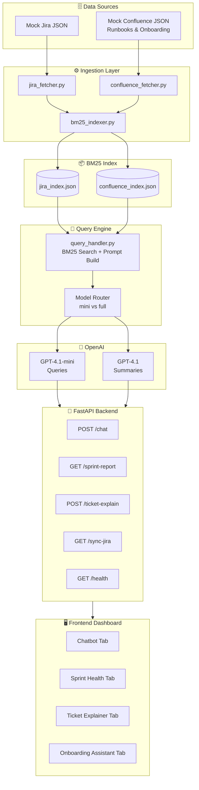

# DevIQ  High-Level Design

## Architecture Overview

## Component Responsibilities

| Component | Responsibility |
|---|---|
| `jira_fetcher.py` | Loads mock Jira JSON, normalizes ticket schema |
| `confluence_fetcher.py` | Loads mock Confluence JSON, extracts page body |
| `bm25_indexer.py` | Tokenizes content, builds BM25 corpus, saves index |
| `query_handler.py` | Tokenizes query, scores corpus, assembles top-k context, calls OpenAI |
| `FastAPI` | HTTP layer, request validation, rate limiting, response formatting |
| `Model Router` | Routes to `gpt-4.1-mini` (chat) or `gpt-4.1` (sprint reports/summaries) |

## System Boundaries

> [!info] What's In Scope (Demo)
> Mock data only. No live Jira/Confluence. No auth layer. No persistent DB.

> [!warning] What's Out of Scope (Demo)
> Vector embeddings, semantic search, multi-tenant, user sessions, real SSO.

## Related Notes
- [[LLD Components]]
- [[Tech Stack Decisions]]
- [[Data Flow Diagram]]