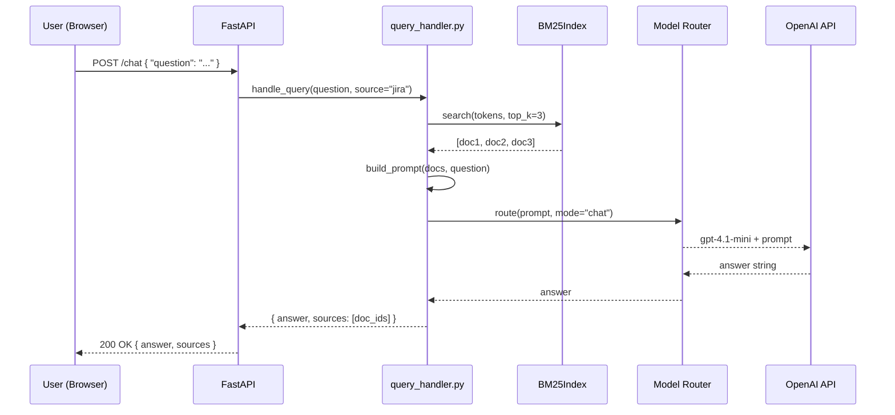
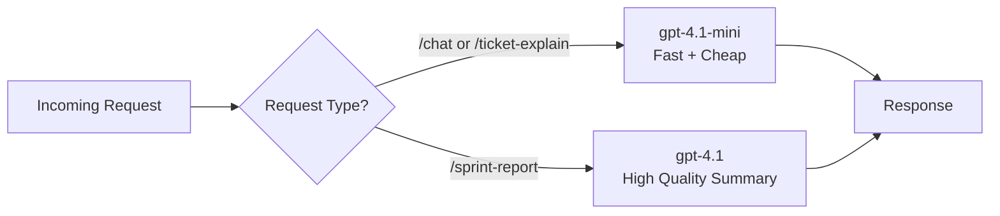

# DevIQ — Low-Level Design

## Query Flow — Sequence Diagram



## Mock Jira Ticket Schema

```json
{
  "id": "PROJECT-1042",
  "summary": "Enable mTLS for Global Platform services",
  "description": "All microservices in GPR epic must support mutual TLS...",
  "status": "In Progress",
  "priority": "High",
  "epic": "Global Platform Readiness",
  "assignee": "john.smith@bank.com",
  "sprint": "Sprint 24",
  "story_points": 5,
  "labels": ["security", "platform", "infra"],
  "created": "2026-03-15",
  "updated": "2026-04-10"
}
```

## FastAPI Route Contracts

| Route             | Method | Input                             | Output                                          |
| ----------------- | ------ | --------------------------------- | ----------------------------------------------- |
| `/chat`           | POST   | `{ question: str, source?: str }` | `{ answer: str, sources: list }`                |
| `/sprint-report`  | GET    | `?sprint=Sprint+24`               | `{ summary: str, health: str, blockers: list }` |
| `/ticket-explain` | POST   | `{ ticket_id: str }`              | `{ explanation: str, plain_english: str }`      |
| `/sync-jira`      | GET    | —                                 | `{ indexed: int, status: str }`                 |
| `/health`         | GET    | —                                 | `{ status: "ok", version: str }`                |

## Model Routing Logic



